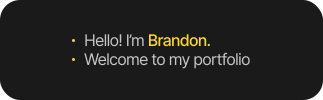

Thanks for taking the time to check out my portfolio! I built this website with Turbo, Next.js, TailwindCSS, and Contentful (for all the CMS goodiness).

If you want to use this look for your own personal website, feel free to clone this repo and change it how you'd like! Just remember to use your own content management system or put all your content in the code itself!
